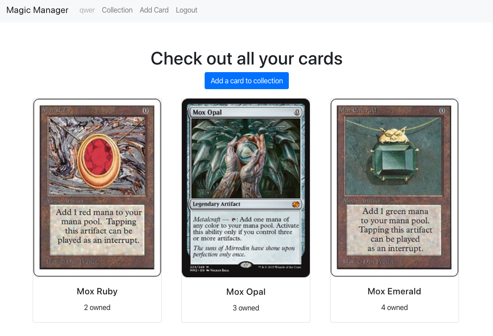

## Magic Manager
The goal for **Magic Manager** is to be a tool that allows a *Magic: the Gathering* player to create a searchable inventory of the cards they own. 

## Motivation
In order to play the *Magic: the Gathering* it is important that to know what cards you have access to. *Magic: the Gathering* is a collectable card game with over 18,000 unique cards printed. With even a small collection, it can be easy to lose track of which and how many cards you own. Technology provides great tools for making this collection search-/sort-able.

## Screenshots

## Frameworks used
### Built with
- [React](https://reactjs.org/)
- [Create React App](https://github.com/facebook/create-react-app)

